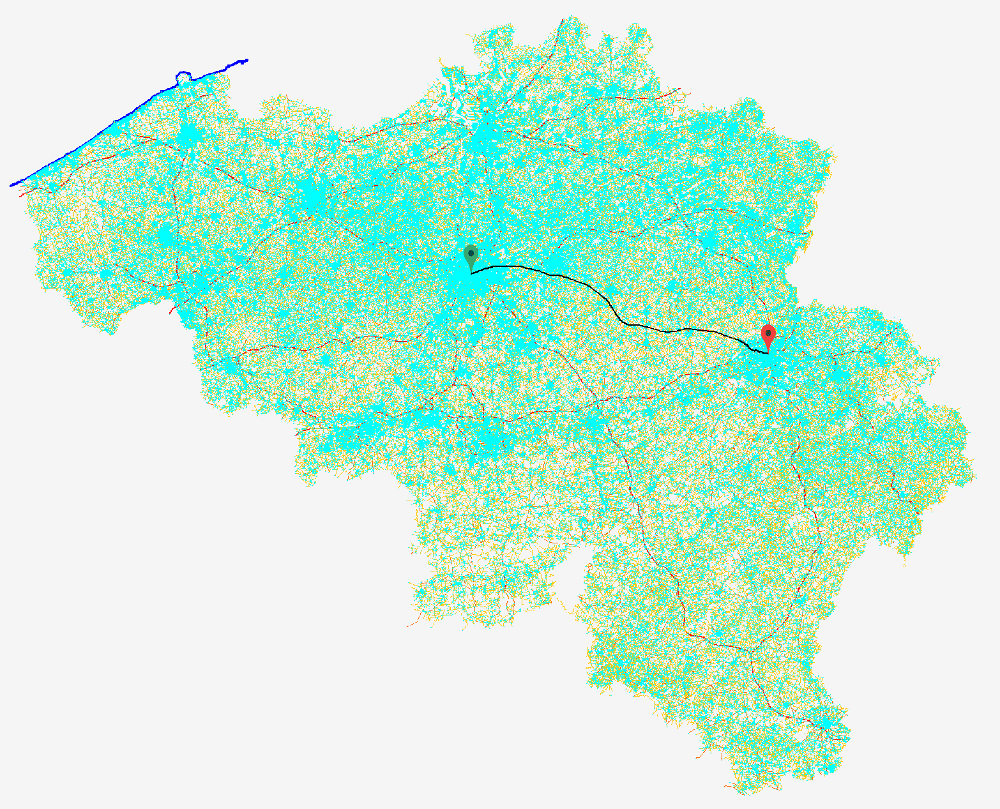
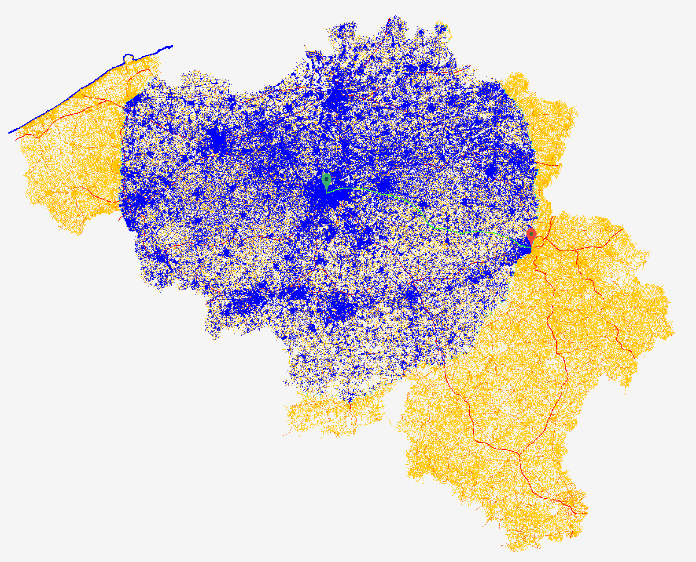
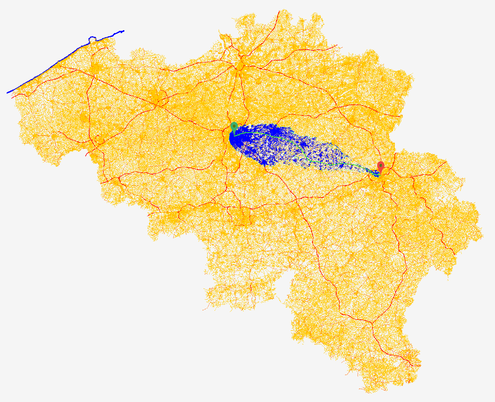
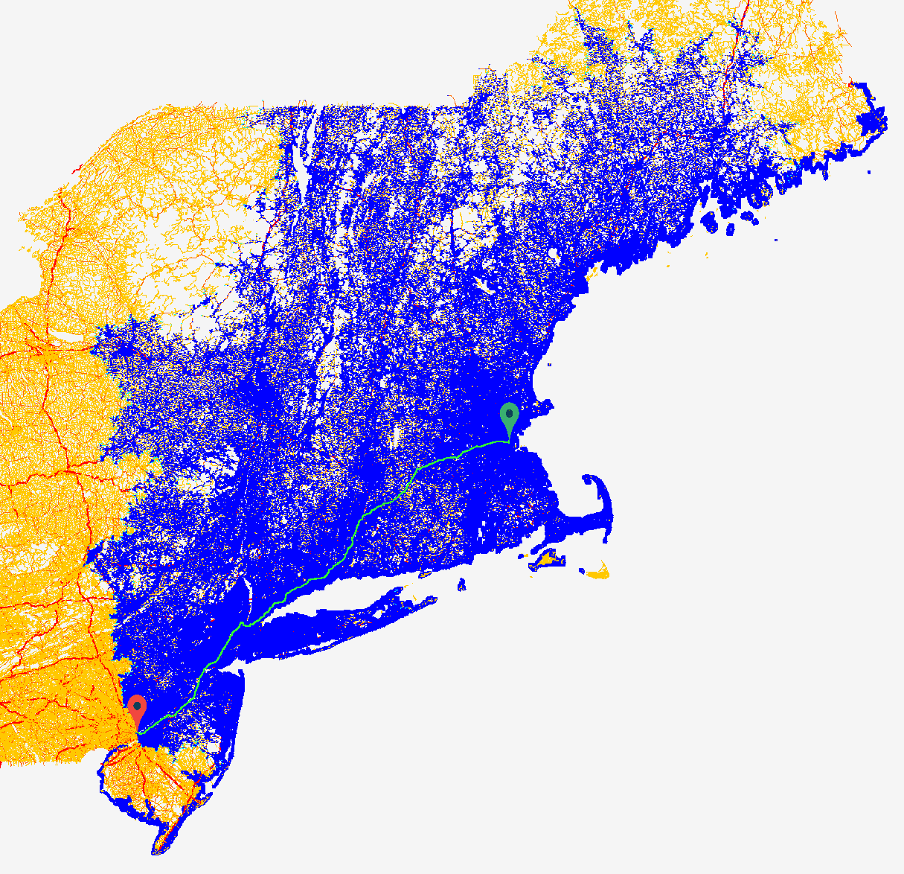
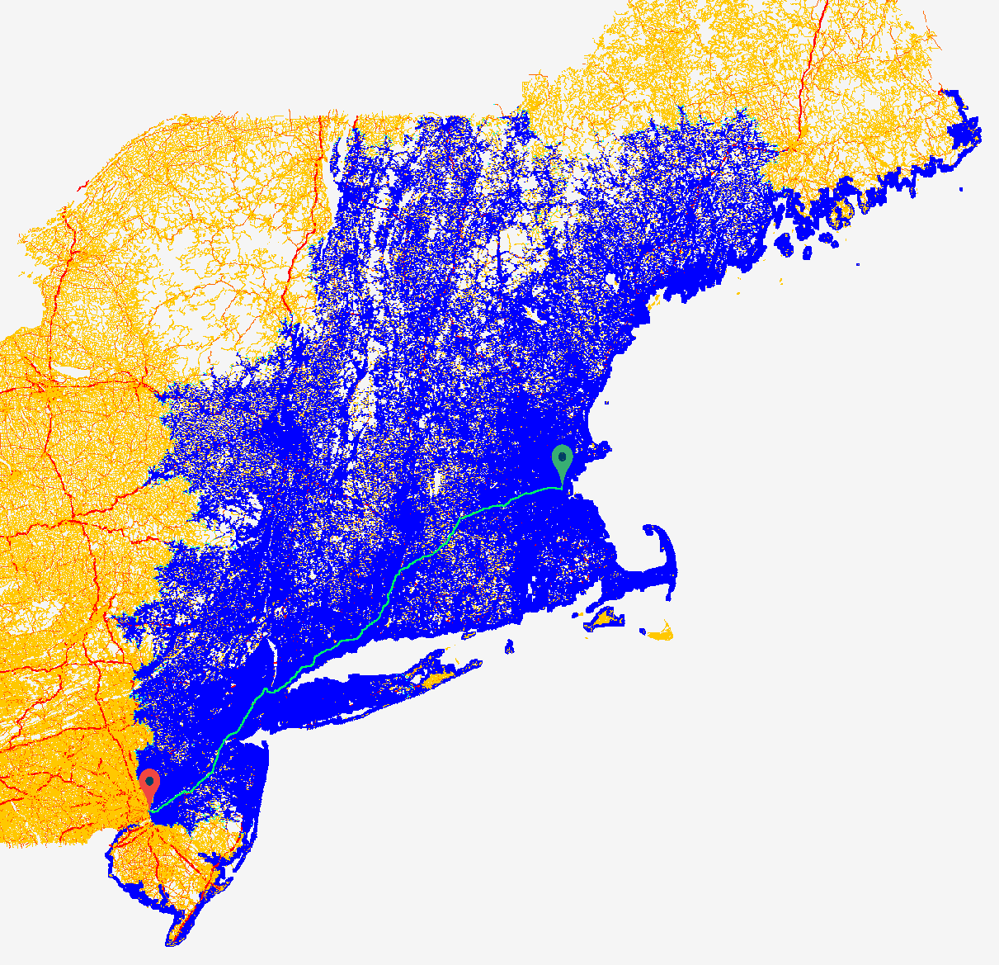

# Graphs & Algorithms Project

A GUI application that allows you to find the shortest or fastest path between two points on a map. Provides the choices between Bellman-Ford, Dijkstra's and A\* algorithms for doing so. Allows you to observe the algorithm's progression as it finds the shortest or fastest path.

This project was part of a graph theory course at university.

## Objectives

- Pick up an existing project, examine its important parts and add new features on top.
- Put graph theory and object-oriented programming into practice by implementing Dijkstra's and A\* shortest path algorithms.
- Write unit tests and use existing unit tests to verify correctness of the implementation.
- Assess performance differences between algorithms and come up with ways to prove that an implemented algorithm is (highly likely) optimal.

## Usage

To find the shortest or fastest path between two points, one first needs to download a .tgz map archive from [here](https://data.typename.fr/insa) and extract it to a convenient place.

Then clone this repository and import it as a Maven project in your IDE of choice.

In your IDE, select the `be-graphes-gui` folder and run it as a Java application from `MainWindow`. The GUI application should open and prompt you to open a map. A popup should appear allowing you to navigate to where you extracted your map.

To find the shortest or fastest path, select **Algorithms** in the top menu bar and select **Shortest-Path**. In the menu that opens to the right, select the algorithm of choice, set the origin and destination (accepts a node ID or can use **Click** to select on the map) and the algorithm mode. Modes to choose from are shortest path, shortest path for cars only, fastest path, fastest path for cars only and fastest path for pedestrians.

Click **Start** to run the algorithm and observe its progress. The blue marking indicates the algorithm explored that area. To make the calculated path easier to see, the blue marking can be removed by clicking **Graph** > **Redraw**. The menu to the right also shows the path length and how long it would take to travel that path.

## Examples

On a map of Belgium, shortest path from central Brussels to central Liège.

- **Bellman-Ford**: 170 seconds
  
- **Dijkstra's algorithm**: 9 seconds
  
- **A\* algorithm**: 1 second
  

On a map of the Northeastern United States, fastest path from downtown Boston to downtown Philadelphia.

- **Bellman-Ford**: _too many_ seconds
- **Dijkstra's algorithm**: 71 seconds
  
- **A\* algorithm**: 60 seconds
  
  In this case, the heuristic chosen for A\*'s fastest path mode is not as optimal as for the shortest path mode, so the performance gains against Dijkstra's algorithm are not as remarkable.
